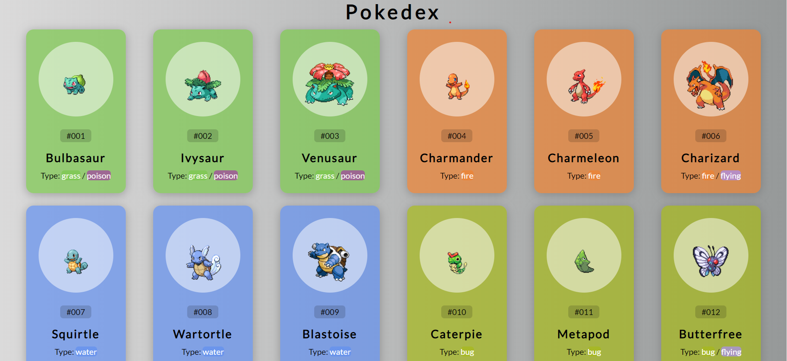

# BasicPokedex

## Descrição do Projeto

Este é um projeto simples de Pokedex criado usando HTML, CSS e JavaScript. A Pokedex exibe informações sobre os primeiros 151 Pokémon da série, utilizando a PokeAPI para obter dados detalhados e carregando imagens dinamicamente a partir do repositório no GitHub.

## Detalhes da Integração com a PokeAPI

- **Endpoint Utilizado:** [PokeAPI - Pokémon Data API](https://pokeapi.co/api/v2/pokemon/)
- **Detalhes Obtidos:** Nome, número, tipos e outras informações sobre cada Pokémon.

## Carregamento Dinâmico de Imagens

As imagens dos Pokémon são carregadas dinamicamente a partir do repositório no GitHub. A URL utilizada para as imagens é [PokeAPI Sprites Repository](https://raw.githubusercontent.com/PokeAPI/sprites/master/sprites/pokemon/1.png).

## Recursos Principais

- **Design Responsivo:** A interface é projetada para ser amigável em dispositivos de diferentes tamanhos.
- **Estilo Atraente:** Utiliza gradientes e sombras para proporcionar uma experiência visual agradável.
- **Interação Dinâmica:** As cartas dos Pokémon reagem ao hover do mouse, revelando uma animação sutil.
- **Informações Detalhadas:** Cada carta exibe o número do Pokémon, seu nome, tipo(s) e uma imagem representativa.
